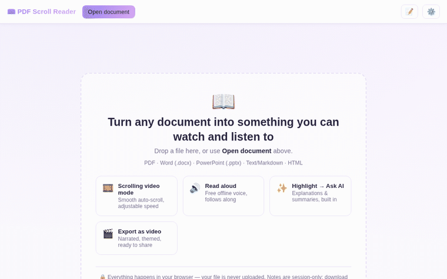

# PDF Scroll Reader



A browser-based app that turns a document — PDF, Word (.docx), PowerPoint (.pptx), plain text/Markdown, or HTML — into a smooth scrolling "video-like" reading experience: auto-scroll playback, a real voice reading it back to you, highlight-to-AI explanations, AI summaries, freeform notes, a soft/gentle theme picker, and an export to an actual narrated video file for LinkedIn or any other platform.

**Live**: [pdf-scroll-app.pages.dev](https://pdf-scroll-app.pages.dev) · [pdf-scroll-app.sriram-c76-254.workers.dev](https://pdf-scroll-app.sriram-c76-254.workers.dev) (see [ARCHITECTURE.md](ARCHITECTURE.md) for why there are two)

Your document is never uploaded anywhere — everything from parsing to rendering happens client-side in your browser. Only the AI features ("Ask AI" / "Summarize") make a network call, to this app's own server-side proxy — see below.

## Running it locally

No build step for the frontend. Serve the folder over `http://` (module scripts and vendored assets won't load from a bare `file://` URL):

```sh
python3 -m http.server 8934
# or: npm run serve
```

Then open `http://localhost:8934/`. Everything works this way **except** "Ask AI" / "Summarize" — those need the Cloudflare Worker (see [Deploying](#deploying) below), since that's what runs the AI model. Locally you'll see those features fail gracefully with a clear error rather than pretend to work.

## Features

- **Open PDF, DOCX, PPTX, TXT, MD, or HTML** — drag-and-drop or the "Open document" button.
- **Scrolling video mode** — Play/Pause auto-scrolls the document at an adjustable speed, with a seekable progress bar. Fully offline.
- **Read aloud** — the browser's built-in text-to-speech (Web Speech API), highlighting and auto-scrolling to the section currently being read. Choose the voice, rate, and pitch in Settings. Fully offline, free.
- **Highlight → Ask AI** — select any text to get a floating toolbar: ask for an explanation of the passage, add it straight to your notes, or have it read back to you.
- **Summarize** — current section or the whole document (long documents are chunked and combined automatically).
- **Notes** — a free-text panel plus your saved AI answers/summaries, session-only by design (see below). Download as Markdown any time; closing the tab clears it for good.
- **Theme picker** — Settings → Appearance: a soft-palette swatch grid (Lavender, Sage, Sky, Sand, Blush, Dark, or Auto to follow your OS). Persists across visits; applied before first paint so there's no flash of the wrong theme.
- **Resizable sidebar** — drag the handle on the sidebar's left edge; the width persists too.
- **Export video** — renders the whole document into a downloadable `.webm` video (square/vertical/landscape), with your live microphone narration, an optional title card, scroll-synced burned-in captions, and an optional quiet background music bed. Three animation styles (smooth scroll, smooth scroll with a slow Ken Burns zoom, or slide-by-slide with crossfades) and four themes (Classic, Midnight, Sunrise, Mono). Scroll speed defaults to whatever you've currently set for on-screen reading. `.webm` is natively supported on LinkedIn and most social platforms.

## AI — free, no key required

"Ask AI" and "Summarize" run on **Cloudflare Workers AI** (`@cf/meta/llama-3.3-70b-instruct-fp8-fast`), bound directly to the server-side code that serves this app. There is no API key to obtain, paste in, or manage — the model runs on Cloudflare's free tier and its credentials never exist in the browser at all, since there aren't any to leak. See [ARCHITECTURE.md](ARCHITECTURE.md) for how this is wired up and why it works identically on both deployment targets.

## What's session-only vs. what needs the internet

| Feature | Needs internet? | Persists after closing the tab? |
|---|---|---|
| Opening/scrolling/reading documents | No | No (reopen the file next time) |
| Read Aloud (voice) | No | — |
| Notes | No | No — **download before closing** |
| Theme / sidebar width | No | Yes (`localStorage` — a UI preference, not content) |
| Video export | No (mic-only, local) | No — **download the video before closing** |
| Ask AI / Summarize | Yes (calls this app's own Worker) | Nothing to persist — no key, no account |

## Project layout

```
index.html                 Shell + all UI markup
css/                        styles.css (themes, layout) + vendored pdf.js text-layer rules
js/
  app.js                    Wires everything together
  loaders/                  One loader per format → { title, kind, textBlocks }
    sanitizeHtml.js          Shared sanitizer for .html and Markdown's raw-HTML passthrough
  scrollPlayer.js            Auto-scroll "video" playback
  voiceReader.js              Web Speech API read-aloud + highlighting
  aiClient.js                 Calls this app's own /api/ai/* endpoints
  notes.js                    Session-only notes panel
  theme.js                    Theme picker (localStorage-persisted)
  sidebarResize.js            Draggable sidebar width (localStorage-persisted)
  videoExport.js               Filmstrip build + canvas/MediaRecorder video export
src/
  worker.js                  Workers entry point: serves static assets, proxies /api/ai/*
  aiHandlers.js                Shared AI prompt/handler logic (used by both deploy targets)
functions/api/ai/            Cloudflare Pages Functions equivalent of src/worker.js's routes
vendor/                     Vendored pdf.js, mammoth, JSZip, marked, html2canvas
                            (no CDN dependency — works fully offline once loaded)
wrangler.jsonc               Workers config: static assets + AI binding
test/smoke.mjs               Playwright smoke test (dev-only, not needed to use the app)
```

See [ARCHITECTURE.md](ARCHITECTURE.md) for how the pieces above fit together, why there are two deployment targets sharing one AI implementation, and notes on the security/rendering decisions worth a reviewer's attention.

## Format support notes

- **PDF** — full-fidelity rendering via pdf.js: pages are drawn to canvas exactly as designed, so this is the one format immune by construction to any color/contrast issue below — nothing is restyled.
- **DOCX** — converted via mammoth.js into a continuous flowing article (no fixed "pages", since Word doesn't store pagination either). Mammoth's default conversion is semantic-only — it discards direct/manual formatting like font color and highlight fills — so unlike HTML, there's no risk of e.g. white-on-white text from a document that used manual color formatting. Verified with a fixture containing an explicit white-on-black run.
- **PPTX** — a lightweight from-scratch reader (JSZip + XML parsing): extracts each slide's title, bullet text, and images into a clean "slide card". It only ever reads text content, never color/formatting — so it can't reproduce a slide's original color scheme, but it also can't render invisible text. It is **not** a pixel-perfect PowerPoint renderer — fonts, exact positions, and animations aren't reproduced, but the content is fully readable, narratable, and summarizable.
- **TXT** — split into paragraphs, no styling of any kind in the source to preserve or lose.
- **MD** — rendered via marked.js, then run through the same sanitizer as `.html` uploads, since marked passes any raw HTML embedded in the source straight through by default.
- **HTML** — parsed with DOMParser. `<script>`, event-handler attributes (`onclick` etc.), and `javascript:` URLs are stripped. Unlike a naive sanitizer, `<style>` tags are **not** discarded — most real HTML documents define their look via CSS classes, and dropping the stylesheet while keeping the markup silently breaks color pairing (e.g. white text that depended on a dark box background goes invisible once that class is gone). Styles are instead extracted and re-injected scoped via the CSS `@scope` at-rule to just that document's container.

## Video export notes

- Uses your microphone live while the scroll plays — read along at whatever pace you like; the scroll speed slider controls how fast it moves.
- Burned-in captions are synced to **scroll position**, not to speech-recognized words (there's no speech-to-text step) — so they track along with what's currently on screen, not word-for-word with your voice.
- Long documents produce long videos; there's no time limit, but very large documents will take a while to rasterize before recording starts.

## Deploying

This app runs on two Cloudflare deployment targets in parallel (see [ARCHITECTURE.md](ARCHITECTURE.md) for the full why):

```sh
# Git-connected Worker (auto-deploys on push to main) — set up once via the
# Cloudflare dashboard's "Connect to Git" flow; no manual command needed after that.

# Direct-upload Pages project (redeploy manually after each change):
wrangler pages deploy . --project-name=pdf-scroll-app --branch=main
```

Both share the exact same static frontend and the exact same AI handler logic (`src/aiHandlers.js`), so they behave identically.

## Dev-only test suite

`test/smoke.mjs` drives the app with Playwright against a real (system) Chromium to catch regressions — file loading for all six formats, auto-scroll, voice reader state, notes/theme/sidebar persistence, the highlight toolbar, sanitization (including a reproduction of the real dark-box/white-text bug this app once shipped), and a full video export in three animation modes. It's not part of the app itself.

```sh
npm install       # installs playwright-core only
npm run serve     # in one terminal
npm test          # in another — AI-dependent checks skip gracefully against the
                  # local static server and only run meaningfully against a deployed URL
```

## Regenerating the demo GIF / OG image

`scripts/capture-demo.mjs` drives a live deployment through the app's core features (Playwright + system Chromium) and saves numbered screenshots; `scripts/make-gif.py` (Pillow) assembles them into `assets/demo.gif`.

```sh
npm install --no-save playwright-core
node scripts/capture-demo.mjs      # defaults to https://pdf-scroll-app.pages.dev
python3 scripts/make-gif.py
```
